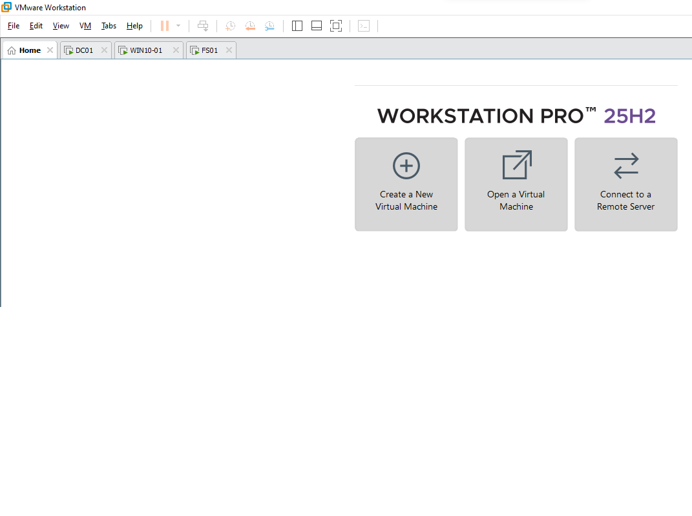
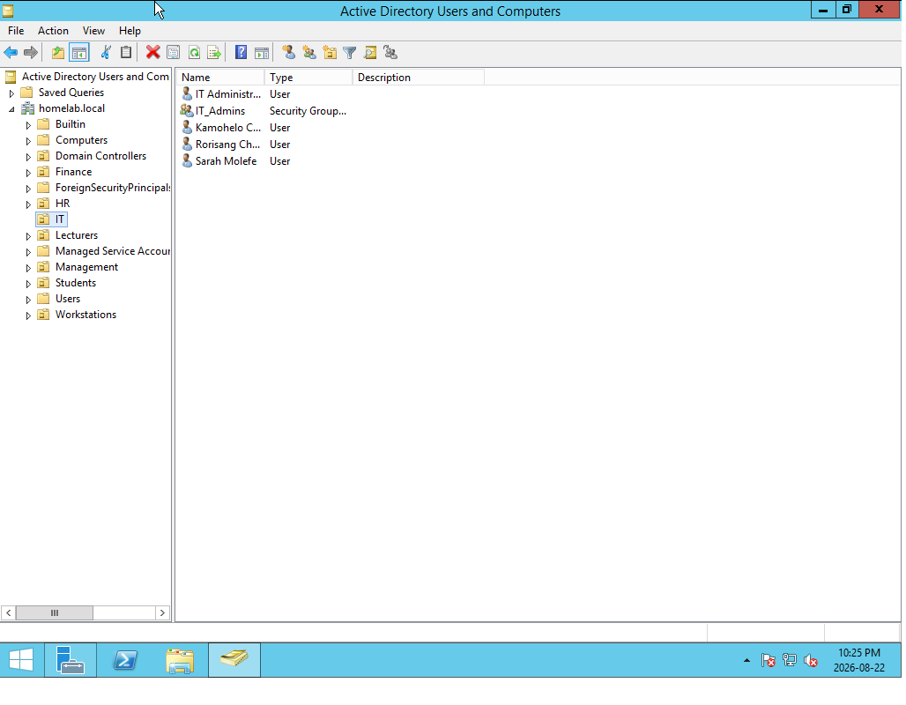
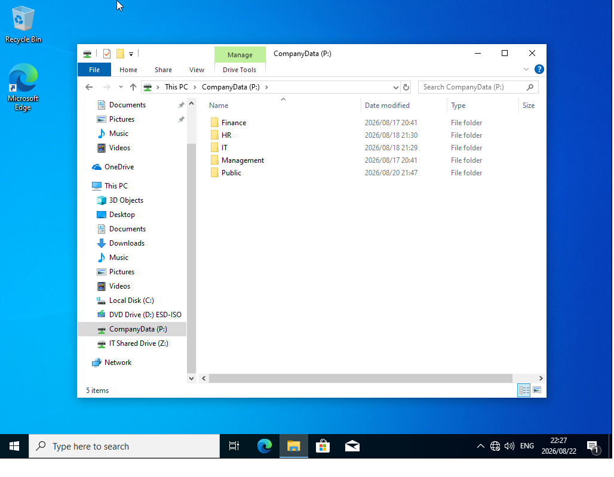
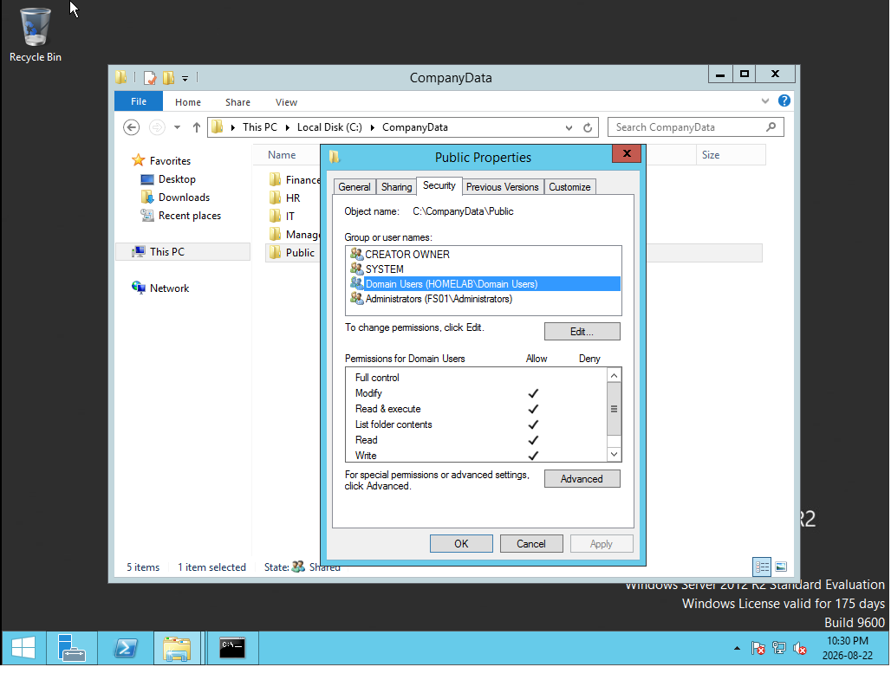
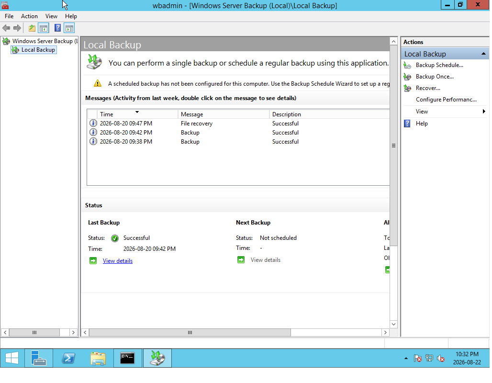
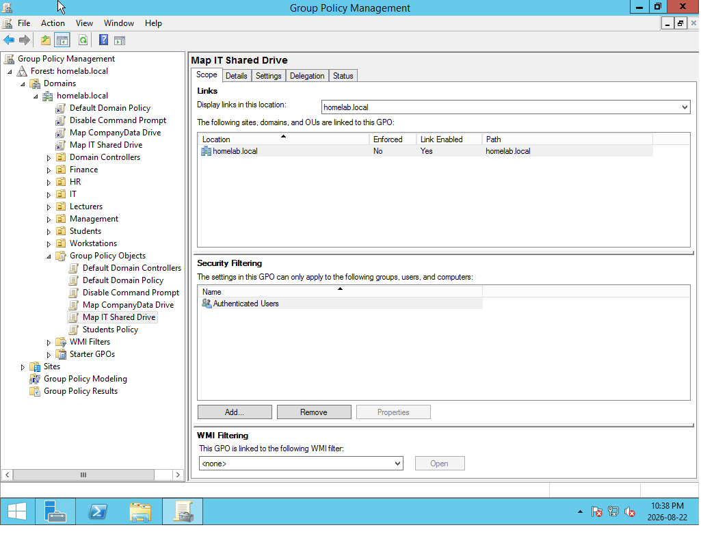
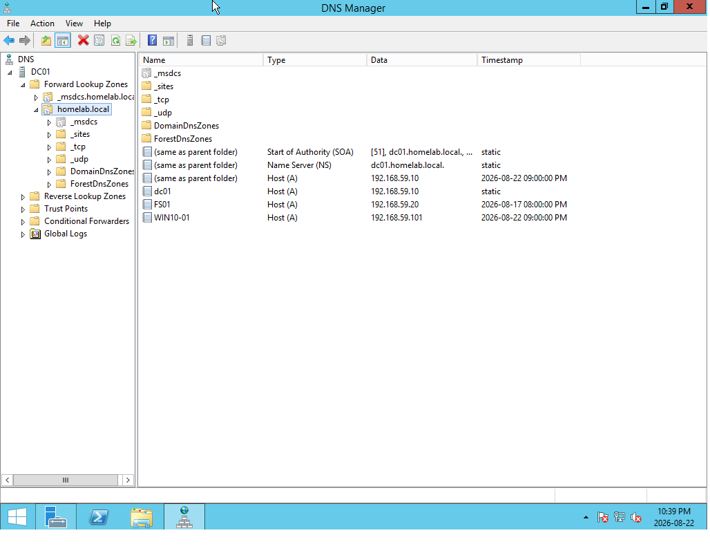
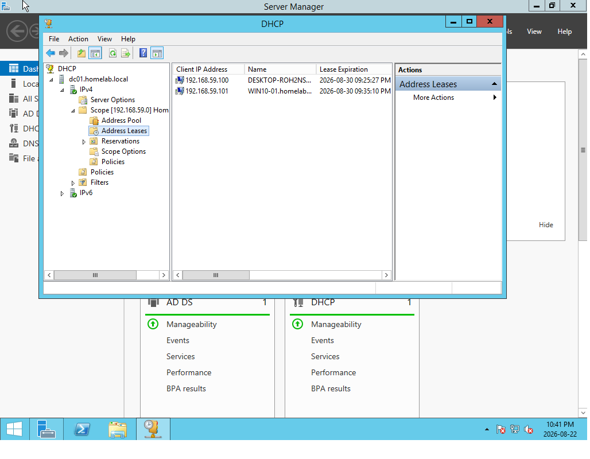

# Windows Server Homelab — homelab.local

A fully functional Windows Server domain environment built for learning and practising enterprise IT skills.

*Platform:* VMware Workstation Pro 25H2  
*Domain:* homelab.local  
*Network:* 192.168.59.0/24

---

## Screenshots

### Lab Overview (VMware)

### Active Directory Users and Computers

### Mapped Drives (Group Policy)

### File Server Permissions

### Windows Server Backup

### Group Policy

### DNS Manager

### DHCP Leases

---

## Lab Overview

| Server / Client | Role | IP Address | Status |
|-----------------|------|------------|--------|
| *DC01* | Domain Controller, DNS, DHCP, GPO | 192.168.59.10 (Static) | Online |
| *FS01* | File Server + Windows Server Backup | 192.168.59.20 (Static) | Online |
| *WIN10-01* | Domain-joined Windows 10 client | DHCP | Online |

---

## What This Lab Demonstrates

- New Active Directory Forest & Domain (homelab.local)
- DNS and DHCP configuration
- Organizational Units, Users and Security Groups
- Account lockout policy
- Group Policy (Command Prompt restriction + Mapped Drives)
- File Server with SMB shares and NTFS permissions
- Mapped network drives (Z: and P:)
- Windows Server Backup + successful restore test
- Network troubleshooting (Firewall, ICMP, APIPA)

---

## Documentation

- [Architecture](docs/architecture.md)
- [Domain Controller (DC01)](docs/dc01.md)
- [Active Directory](docs/active-directory.md)
- [File Server (FS01)](docs/fs01.md)
- [Group Policy](docs/group-policy.md)
- [Backup & Recovery](docs/backup-recovery.md)
- [Troubleshooting](docs/troubleshooting.md)

---

## PowerShell Scripts

- New-HomelabUser.ps1 – Create a new AD user
- New-HomelabOU.ps1 – Create a new Organizational Unit
- Get-HomelabStatus.ps1 – Quick lab health check

---

## Author

*Kamohelo Chaba*  
IT Support Intern | Goldfields TVET College  
[LinkedIn](https://linkedin.com/in/kamohelo-chaba-107155243)

---

Built for continuous learning and professional growth in Windows Server administration.
